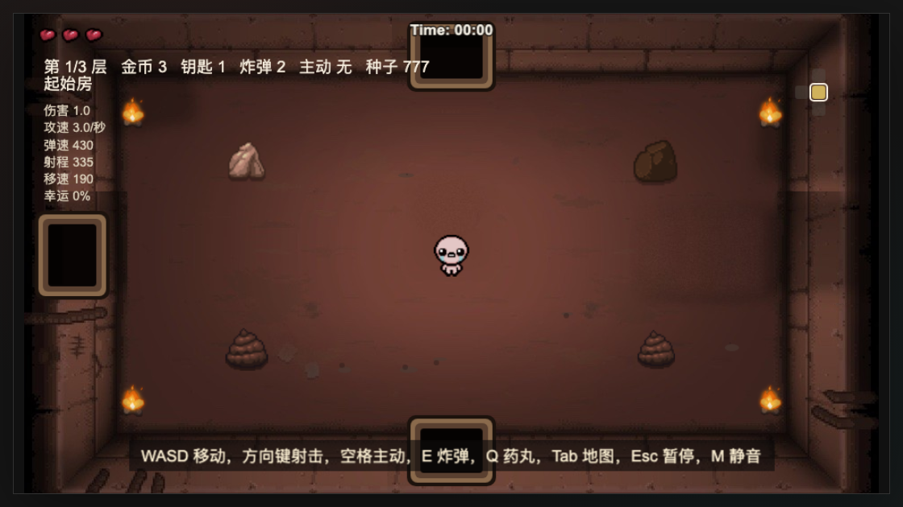
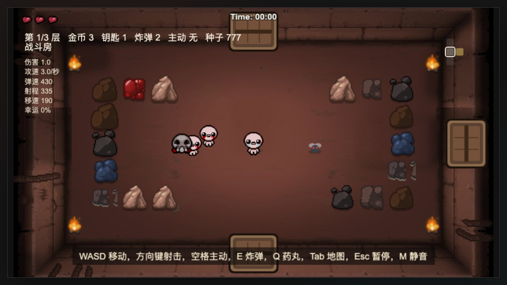
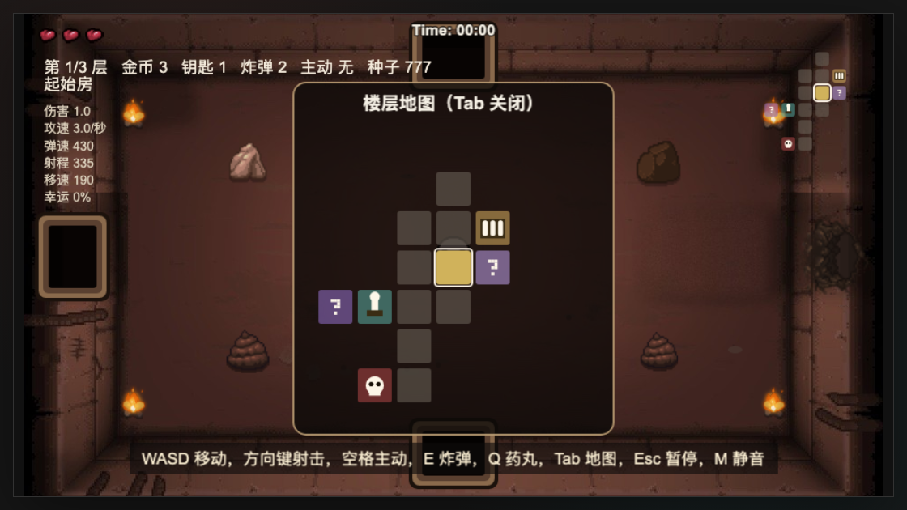
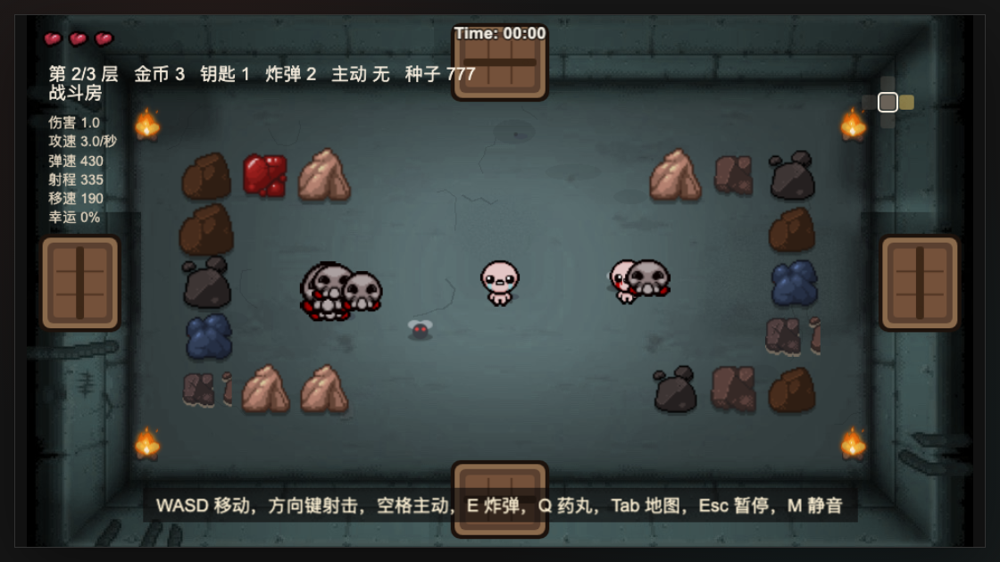
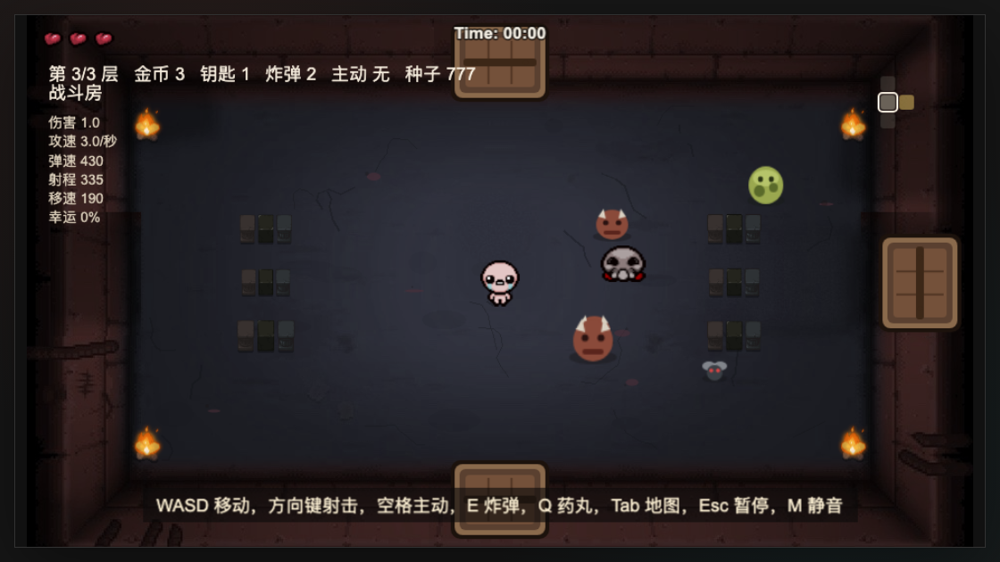

# 地窖泪弹

《以撒的结合：忏悔》复刻小游戏，Phaser 3 浏览器直玩。

**在线游玩：https://tunshusama.github.io/isaac-game/**

素材已全部内嵌进 `assets-data.js`（base64），不依赖任何网络资源；本地玩直接双击 `index.html`（`file://` 协议）即可，也可以用本地服务器：

```bash
python3 -m http.server 4173
```

然后打开 `http://localhost:4173`。

## 截图

| 一层·起始房 | 一层·战斗 |
| --- | --- |
|  |  |

| 楼层地图 | 二层·洞穴 |
| --- | --- |
|  |  |

| 三层·深处 |
| --- |
|  |

## 操作

手机/平板打开自动显示触屏控件（竖屏会提示旋转）：左摇杆移动、右摇杆射击，右上角依次是主动道具、药丸/卡牌、炸弹，旁边有暂停键。键盘操作：

- WASD：移动
- 方向键：射击
- 空格：使用主动道具
- E：放炸弹（可炸毁岩石/便便/壁炉/TNT，靠近可疑墙可炸开隐藏房，会炸伤自己）
- Q：使用持有的药丸/卡牌
- Tab：全屏楼层地图（再按关闭）
- Esc 或 P：暂停/继续（暂停页显示本局种子号与六项属性面板）
- M：静音/取消静音（音乐与音效）
- 重开：刷新页面即可重开一局（已移除 R 键重开）

## 玩法要点

- 共 3 层（地窖→洞穴→深处），各有主题色调、敌人池与障碍组合；Boss：1 层萌死戳，2 层双子/古迪/粪山轮抽，3 层妈腿，击败妈腿即通关
- 血量为半心粒度：触碰/敌子弹扣半心，Boss 触碰/尖刺/自炸扣 1 整心；魂心（蓝心）优先于红心承受伤害
- 泪弹是带高度的抛物线，射程/弹速/攻速/伤害均受属性影响，命中或落地会溅射
- 药丸效果每局随机（含坏效果），卡牌有传送/全图揭示/加攻等；木箱金宝箱可开出补给或道具
- 障碍按原版组合：不可逾越的沟壑（pit）、受击即爆的 TNT 炸药桶、4% 概率混入的染色岩、可三段打退化的便便；岩石皮肤随楼层主题变化
- 2 层起道具房和商店需要钥匙；商店可捐款升级，可能出现红签半价 SALE
- Boss 房清理后概率在墙面开出恶魔房红门，可用生命上限或魂心交易
- 隐藏房无提示，只能靠炸墙发现：普通隐藏房恰 1 个，超级隐藏房恰 1 个
- 怪物按原版阵容：爬虫/霍夫/苍蝇/胖蚊/跳蛙/蜘蛛/爆蝇/吸盘/自弃者/Host 龟壳等；精英分红/蓝/黑三色，另有稀有金色超级精英双倍掉落

## 素材说明

原版贴图取自官方 Wiki（bindingofisaacrebirth.wiki.gg，仅作复刻学习用途），由脚本转成 base64 内嵌到 `assets-data.js`。
